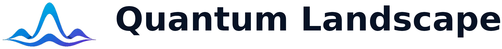
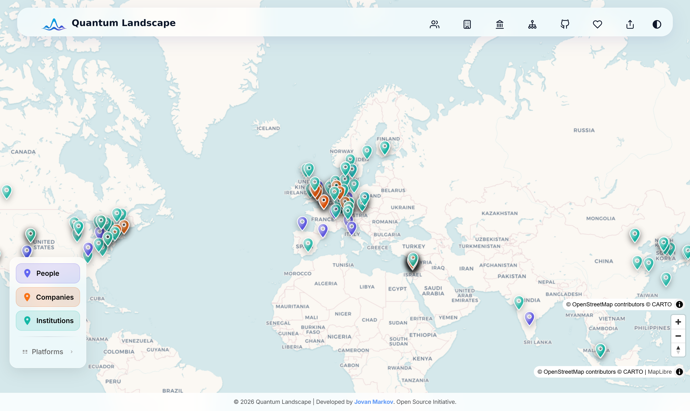
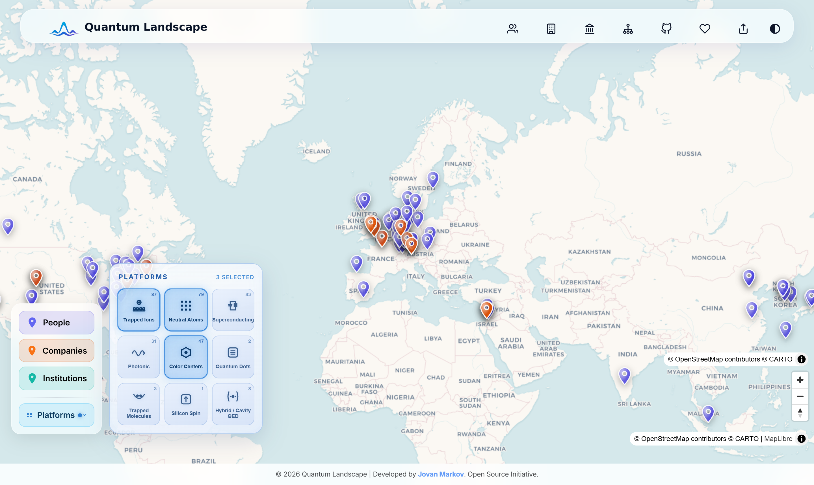
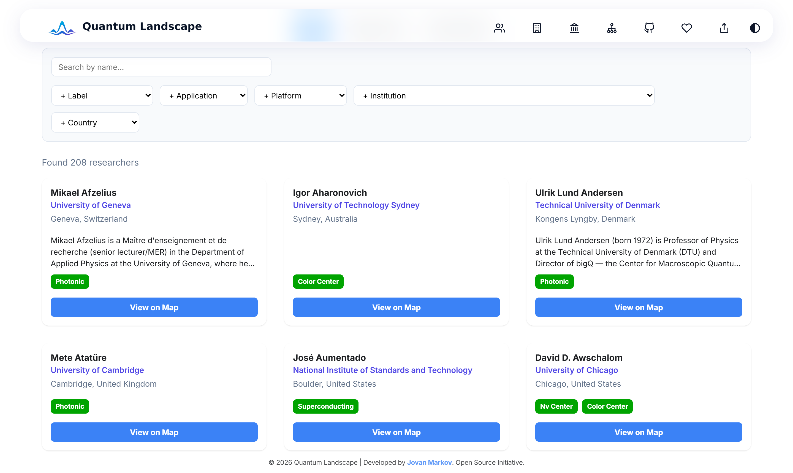
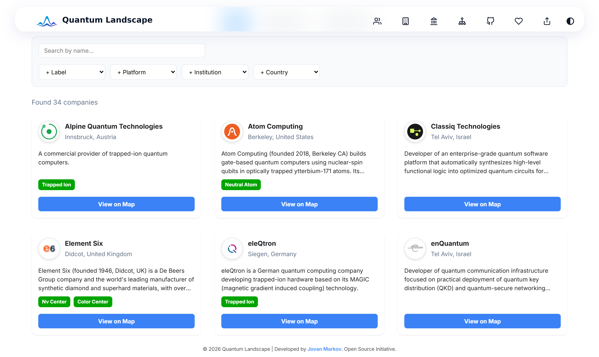
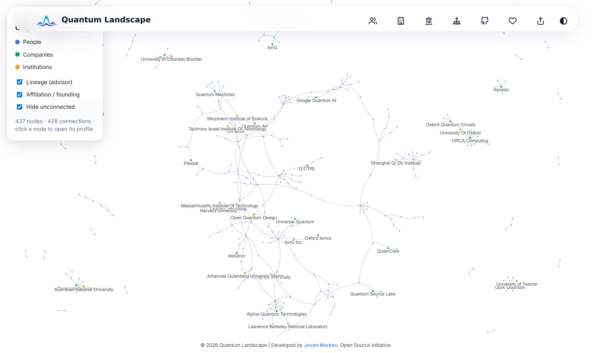
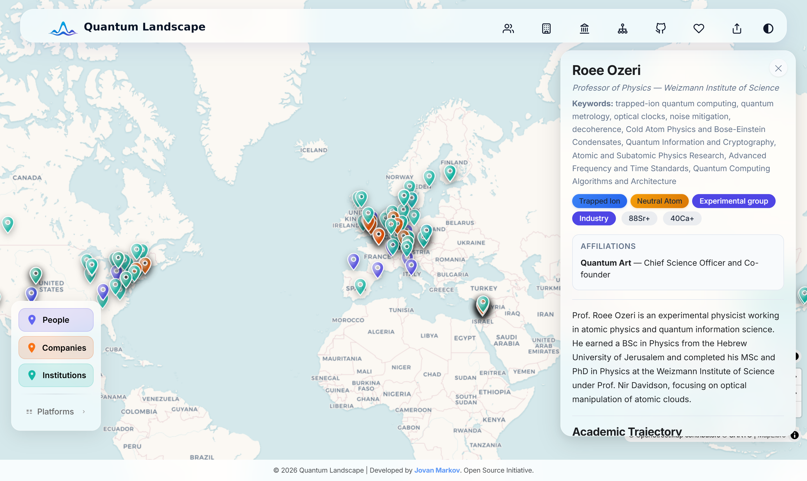

<p align="center">
  <picture>
    <source media="(prefers-color-scheme: dark)" srcset="website/static/img/brand/wordmark-horizontal-on-dark.png">
    
  </picture>
</p>

<p align="center">
  <b>An interactive map and academic family tree of the quantum technology landscape.</b><br>
  Explore the people, research groups, institutions, and companies building quantum computers, simulators, sensors, and networks — and how they all connect.
</p>

<p align="center">
  <a href="https://jovanmarkov.com/quantum-landscape/"><b>🌐&nbsp;Live&nbsp;site</b></a> &nbsp;·&nbsp;
  <a href="#-features">Features</a> &nbsp;·&nbsp;
  <a href="#-whats-inside">Data</a> &nbsp;·&nbsp;
  <a href="#-local-development">Local dev</a> &nbsp;·&nbsp;
  <a href="#-contributing">Contributing</a>
</p>

<p align="center">
  
  
  
  
</p>

---

## Overview

**Quantum Landscape** is an open-source project that collects and visualizes information about the
quantum science and technology ecosystem: **research groups, companies, institutions, and the
scientists** behind them. It started as a map of trapped-ion groups and has grown to cover the
full breadth of quantum platforms — trapped ions, neutral atoms and Rydberg arrays,
superconducting circuits, photonics, color centers, quantum dots, trapped molecules, and more.

The goal is to make the field easy to explore: **who** is working on **what**, **where** they are,
**how** academic lineages and industrial efforts connect, and how it all fits together across
quantum computing, simulation, sensing & metrology, and fundamental physics.

> 🌐 **Live at [jovanmarkov.com/quantum-landscape](https://jovanmarkov.com/quantum-landscape/)**

<p align="center">
  
</p>

---

## ✨ Features

### 🗺️ Interactive world map
Every researcher, company, and institution is placed on a world map (MapLibre GL). Pins cluster on
shared locations, and a glassy filter dock lets you toggle **People / Companies / Institutions** and
filter by **qubit platform** through a collapsible tech-tile flyout. People are snapped to their
institution's coordinates so groups cluster cleanly on their home campus.

<p align="center">
  
</p>

### 🔎 Explore & search
Dedicated, filterable directories for **researchers**, **companies**, and **institutions** — search
by name and filter by platform, application, ion/atom species, institution, or country. Nobel
laureates are marked with a medallion next to their name.

<p align="center">
  
  
</p>

### 🌳 Academic lineage graph
An interactive network of **advisor / postdoc / affiliation / founder** relationships — the academic
family tree of the field. Click any node to open its profile. Edges are resolved automatically from
each profile's education, postdocs, and affiliations.

<p align="center">
  
</p>

### 👤 Rich profiles
Each profile panel shows the person's current position, research keywords, platforms & applications,
academic trajectory (education → postdoc → faculty), notable papers, industry affiliations, and
OpenAlex-sourced metrics.

<p align="center">
  
</p>

---

## 📦 What's inside

| Entity | Count | Source of truth |
|---|---:|---|
| 👩‍🔬 Researchers / groups | 400+ | `content/people/*.md` |
| 🏛️ Institutions | 110+ | `content/institutions/*.md` |
| 🏢 Companies | 30+ | `content/companies/*.md` |

All content lives as human-readable **Markdown files with YAML frontmatter** — the single source of
truth. A Python build step compiles them into the JSON/GeoJSON the website consumes. Many profiles
also carry a sibling `*.evidence.md` documenting the source for each field.

---

## 🧱 Project structure

```
quantum-landscape/
├─ content/                     # Source of truth (Markdown + YAML frontmatter)
│  ├─ people/                   #   one file per researcher (+ optional .evidence.md)
│  ├─ companies/                #   one file per company
│  └─ institutions/             #   one file per institution
├─ scripts/
│  ├─ core/build_index.py       # Compiles content/ → website/static/data/*.json + geojson + edges
│  ├─ enrich/                   # OpenAlex harvest, metrics, keywords, geo
│  ├─ ingest/ · discover/       # Profile ingestion & discovery helpers
│  ├─ utils/                    # Logo fetchers, page verifiers, caches
│  └─ requirements.txt          # Python dependencies
├─ schemas/                     # JSON Schemas for person / company / institution + vocabularies
├─ website/                     # Docusaurus 3 site (React)
│  ├─ src/pages/                #   index (map), groups, companies, institutions, lineages
│  ├─ src/components/           #   MapPanel, PersonPanel, CompanyPanel, PlatformFlyout, …
│  └─ static/                   #   img/brand, logos, and generated data/ (git-ignored)
├─ brand-kit/                   # Quantum Landscape logo system & design tokens
├─ docs/                        # Architecture notes, guides, schema docs, screenshots
└─ README.md
```

---

## 🛠️ Local development

**Prerequisites:** Python 3.10+ and Node.js 18+.

```bash
# 1. Python deps for the data pipeline
python -m venv .venv
source .venv/bin/activate            # Windows: .venv\Scripts\activate
pip install -r scripts/requirements.txt

# 2. Compile content/ → website/static/data/ (JSON, GeoJSON, edges)
python scripts/core/build_index.py

# 3. Run the site
cd website
npm ci
npm start                            # http://localhost:3000/quantum-landscape/
```

> ℹ️ The files in `website/static/data/` are **generated, not committed** — re-run
> `python scripts/core/build_index.py` whenever you change anything under `content/`.

### Production build & deploy

```bash
python scripts/core/build_index.py   # regenerate data first
cd website
npm run build                        # static build into website/build/
GIT_USER=<your-gh-user> npm run deploy   # force-pushes the build to the gh-pages branch
```

The site is served from the `gh-pages` branch at
**[jovanmarkov.com/quantum-landscape](https://jovanmarkov.com/quantum-landscape/)**.

---

## 🧬 Data model & curation

Each entity is a Markdown file whose YAML frontmatter conforms to a schema in
[`schemas/`](schemas/). For example, a person carries fields such as `current_position`,
`education[]`, `postdocs[]`, `platforms[]`, `applications[]`, `ion_species[]`, `key_papers[]`,
`links{}`, `location{}`, and `metrics{}`.

`build_index.py` then:

- compiles every profile into `people.json` / `companies.json` / `institutions.json`,
- emits GeoJSON for the map and an **edge list** for the lineage graph,
- resolves advisor / postdoc / affiliation / founder / leadership relationships **by name**,
- links people to institutions and snaps them to institution coordinates.

Enrichment scripts under [`scripts/enrich/`](scripts/enrich/) pull **metrics, topics, and
geo-coordinates from [OpenAlex](https://openalex.org)** (h-index, citation & publication counts).
Affiliation and current position are always human-curated — OpenAlex is used for metrics, links,
keywords, and map geo only.

**Principle:** every fact should be backed by an authoritative source. Don't guess or hallucinate
data; record the source in the profile's `*.evidence.md` file.

For deeper detail see the docs:

- [Frontend architecture](docs/frontend-architecture.md)
- [Schema reference](docs/schema.md)
- [Guides](docs/guides/) — data ingestion & curation

---

## 🧰 Tech stack

- **Frontend:** [Docusaurus 3](https://docusaurus.io/) + React
- **Map:** [MapLibre GL JS](https://maplibre.org/) with CARTO basemap tiles
- **Graph:** force-directed lineage network
- **Data pipeline:** Python ([python-frontmatter](https://python-frontmatter.readthedocs.io/), `requests`)
- **Metrics & geo:** [OpenAlex](https://openalex.org/) API
- **Hosting:** GitHub Pages (custom domain)

---

## 🎨 Brand

The Quantum Landscape logo system, color tokens, and typography live in
[`brand-kit/`](brand-kit/). The gradient "interference" mark works on both light and dark
backgrounds; use the wordmark on wide layouts and the mark alone below ~160 px.

---

## 🤝 Contributing

Contributions of new or corrected profiles are welcome:

1. Add or edit a Markdown file under `content/people|companies|institutions/`, following the
   existing format and the relevant schema in [`schemas/`](schemas/).
2. Only add information you can verify from authoritative sources; cite it in a `*.evidence.md`.
3. Run `python scripts/core/build_index.py` and check the site locally.
4. Open a pull request.

### Data sources

Compiled from authoritative sources, including:

- **[Ion Trapping Worldwide](https://quantumoptics.at/en/links/ion-trapping-worldwide.html)** — the
  ion-trapping group list maintained by the Blatt group at the University of Innsbruck
- Institutional websites and faculty pages
- Google Scholar, ORCID, and [OpenAlex](https://openalex.org/) profiles
- Published papers and PhD theses

---

## ❤️ Support

Quantum Landscape is an independent, open-source project maintained in spare time. If you find it
useful or interesting, you can support it on **[Ko-fi](https://ko-fi.com/quantum_landscape)** — this
helps cover hosting, maintenance, and data curation. Support is entirely optional and implies no
endorsement, affiliation, or listing priority for anyone featured on the site.

---

## 📄 License

Released under the [MIT License](LICENSE). Logos and trademarks of the institutions and companies
featured on the site belong to their respective owners.
